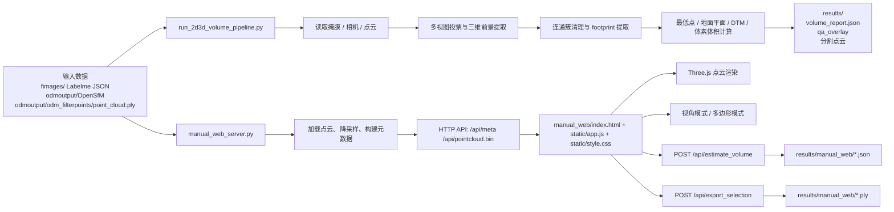

# d2point

d2point 是一个基于 Python 3.12 的 2D/3D 点云融合工作流，用于把 2D 掩膜标注、OpenSfM 相机位姿和 ODM 点云融合起来，输出三维目标分割、体积估算和 QA 可视化结果。

项目提供两个入口：

- 离线执行 2D 到 3D 的分割与体积测算
- 启动本地 Web 页面，对点云进行手动多边形选区并估算体积

更完整的算法说明和参数含义，请继续查看 [README_2D3D_PIPELINE.md](README_2D3D_PIPELINE.md)。

## 代码架构

### 总体结构



### 核心模块职责

- [run_2d3d_volume_pipeline.py](run_2d3d_volume_pipeline.py)
	- `parse_args()` 负责命令行参数解析
	- `main()` 组织整个离线流程
	- 读取 `fimages/`、`masks/`、`odmoutput/opensfm/reconstruction.topocentric.json`、`odmoutput/odm_filterpoints/point_cloud.ply`
	- 执行多视图可见性投票、三维前景提取、聚类净化、基准面/最低点/DTM/体素体积计算
	- 输出 `results/volume_report.json`、QA overlay 和分割点云

- [manual_web_server.py](manual_web_server.py)
	- `ManualVolumeState` 负责点云加载、降采样、选区统计、体积计算和导出
	- `ManualHandler` 负责 HTTP 路由和静态资源分发
	- `main()` 启动 `ThreadingHTTPServer`
	- 主要接口包括 `/api/meta`、`/api/pointcloud.bin`、`/api/estimate_volume`、`/api/export_selection`

- [manual_web/index.html](manual_web/index.html) + [manual_web/static/app.js](manual_web/static/app.js) + [manual_web/static/style.css](manual_web/static/style.css)
	- 浏览器端使用 Three.js 和 OrbitControls 渲染点云
	- 支持视角模式和多边形模式
	- 前端负责圈选点云并把选中点索引发送给后端，完成体积计算和 PLY 导出

## 目录结构

- [run_2d3d_volume_pipeline.py](run_2d3d_volume_pipeline.py)：离线分割与体积测算主程序
- [manual_web_server.py](manual_web_server.py)：本地手动选区与体积估算服务
- [README_2D3D_PIPELINE.md](README_2D3D_PIPELINE.md)：更详细的算法与参数说明
- [fimages/](fimages/)：每张图片对应的 Labelme 多边形 JSON
- [masks/](masks/)：生成的掩膜文件
- [odmoutput/](odmoutput/)：OpenSfM / ODM 输出，包括默认点云
- [results/](results/)：默认报告、QA overlay 和导出结果
- [manual_web/](manual_web/)：手动 Web 服务所需的静态前端资源

## 环境准备

推荐使用仓库中的 Conda 环境配置：

```powershell
conda env create -f .\environment.yml
conda activate d2point
```

如果你已经有一个兼容的 Python 3.12 环境，核心依赖如下：

```powershell
python -m pip install numpy opencv-python-headless pillow scipy scikit-learn
```

## 快速开始

执行离线管线的默认配置：

```powershell
python .\run_2d3d_volume_pipeline.py
```

启动手动 Web 服务：

```powershell
python .\manual_web_server.py
```

启动后访问：

```text
http://127.0.0.1:8765
```

## 常用命令

查看命令行参数：

```powershell
python .\run_2d3d_volume_pipeline.py --help
python .\manual_web_server.py --help
```

把离线管线的实验结果输出到单独目录：

```powershell
python .\run_2d3d_volume_pipeline.py --segmentation-mode seeded_footprint --volume-mode all --output .\results_all_modes
```

在较慢的机器上降低手动 Web 端的点云负载：

```powershell
python .\manual_web_server.py --max-points 80000 --voxel-size 0.1
```

## 输出说明

离线管线默认输出到 `results/`，通常包括：

- `volume_report.json`
- `qa_overlay/` 下的可视化图片
- 分割后的点云导出文件

手动 Web 服务的输出默认写到 `results/manual_web/`，包括 JSON 报告和导出的 PLY 文件。

## 默认行为

当前项目的基准默认配置是：

- 分割模式：`seeded_footprint`
- 体积模式：`lowest_point`

如果你要切换到其他体积估算方式，或者想看更完整的参数说明，请继续查看 [README_2D3D_PIPELINE.md](README_2D3D_PIPELINE.md)。